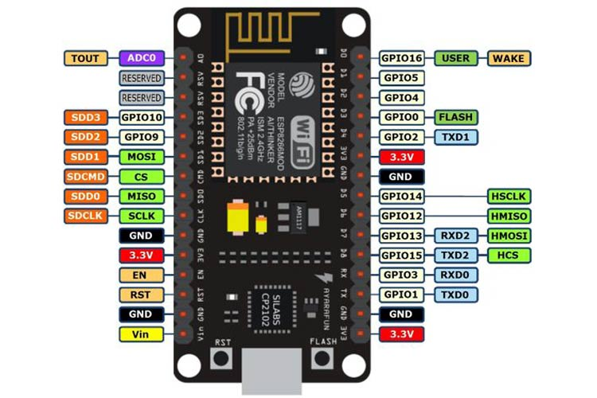
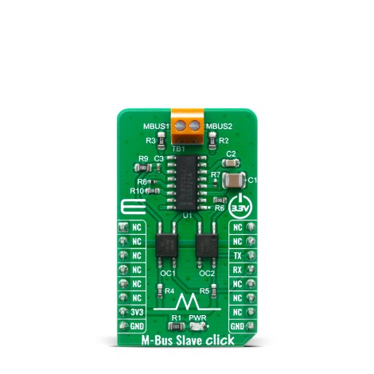

# Overview

A custom component for ESPHome for reading meter data sent by the Kaifa MA309M via M-Bus.

# Supported meters

* Kaifa MA309M

# Exposed sensors

* Voltage L1
* Voltage L2
* Voltage L3
* Amperage L1
* Amperage L2
* Amperage L3
* Active Power Plus
* Active Power Minus
* Active Energy Plus
* Active Energy Minus
* Reactive Energy Plus
* Reactive Energy Minus
* Timestamp
* Meter Number

# Requirements

* ESP8266
* RJ11 cable
* M-Bus to UART board (e.g. https://www.mikroe.com/m-bus-slave-click)
* RJ11 breakout board **or** soldering iron with some wires

# Software installation

Using esphome console: `esphome run smartmeter.example.yaml`

# Hardware installation

| **ESP8266** | **M-Bus Board**           | **RJ11** |
| --------- | ------------- | ---------------- |
| 3.3V        | 3V3 | |
| GND      | GND |  |
| GPIO3       | RX    |  |
| GPIO1    | TX    |  |
|     | MBUS1    | 3 |matter |
|    | MBUS2    | 4 |matter |
